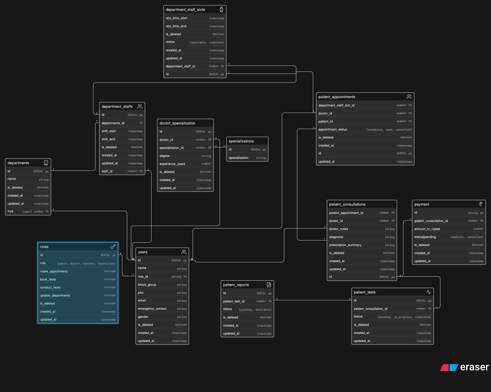

# Clinic Appointment & Diagnostic Platform

## Overview

This ER design models a clinic-level system for managing:
- doctors, patients, and staff roles
- departments and doctor specializations
- appointment scheduling
- consultations and test prescriptions
- diagnostics, reports, and payments

The focus is on a clean, scalable clinic workflow rather than a large hospital system.

## Tables and Purpose

### `roles`
Stores access roles and permissions for clinic users.
- `id`: primary key
- `role`: role name (`admin`, `doctor`, `patient`, `technician`)
- permission flags: `make_appoitments`, `book_tests`, `conduct_tests`, `update_departments`
- soft-delete and audit timestamps

### `users`
Holds every user in the system, including doctors, patients, technicians, and admins.
- `id`: primary key
- `name`, `blood_group`, `phn`, `email`, `emergency_contact`, `gender`
- `role_id`: foreign key to `roles.id`
- soft-delete and audit timestamps

### `departments`
Represents clinic departments or specialty units.
- `id`: primary key
- `hod`: foreign key to `users.id`, identifying the head of department
- `name`: department name
- soft-delete and audit timestamps

### `specializations`
Defines doctor specializations available in the clinic.
- `id`: primary key
- `specialization`: name of the specialization

### `doctor_specialization`
Maps doctors to their specializations.
- `id`: primary key
- `doctor_id`: foreign key to `users.id`
- `specialization_id`: foreign key to `specializations.id`
- `degree`, `experience_years`
- soft-delete and audit timestamps

### `department_staffs`
Tracks staff assignments within departments.
- `id`: primary key
- `departments_id`: foreign key to `departments.id`
- `staff_id`: foreign key to `users.id`
- `shift_start`, `shift_end`
- soft-delete and audit timestamps

### `department_staff_slots`
Represents booking slots for department staff.
- `id`: primary key
- `department_staff_id`: foreign key to `department_staffs.id`
- `slot_time_start`, `slot_time_end`
- `status`: booking state (`available`, `complete`)
- soft-delete and audit timestamps

### `paitent_appointments`
Records patient appointments with a doctor and slot.
- `id`: primary key
- `department_staff_slot_id`: foreign key to `department_staff_slots.id`
- `doctor_id`: foreign key to `users.id`
- `patient_id`: foreign key to `users.id`
- `appointment_status`: `scheduled`, `done`, `cancelled`
- soft-delete and audit timestamps

### `patient_consultations`
Captures consultation details after a patient visit.
- `id`: primary key
- `pateint_appointment_id`: foreign key to `paitent_appointments.id`
- `doctor_id`: foreign key to `users.id`
- `doctor_notes`, `diagnosis`, `prescription_summary`
- soft-delete and audit timestamps

### `patient_tests`
Tracks diagnostic tests prescribed during a consultation.
- `id`: primary key
- `patient_consultation_id`: foreign key to `patient_consultations.id`
- `status`: `pending`, `in_progress`, `completed`
- soft-delete and audit timestamps

### `patient_reports`
Stores report generation status for completed tests.
- `id`: primary key
- `patient_test_id`: foreign key to `patient_tests.id`
- `status`: `pending`, `available`
- soft-delete and audit timestamps

### `payment`
Records consultation-related payments.
- `id`: primary key
- `pateint_consultation_id`: foreign key to `patient_consultations.id`
- `amount_in_rupee`
- `status`: `pending`, `complete`, `cancelled`
- soft-delete and audit timestamps

## Relationships

- `roles.id` < `users.role_id`
- `departments.hod` - `users.id`
- `departments.id` < `department_staffs.departments_id`
- `department_staffs.staff_id` - `users.id`
- `doctor_specialization.doctor_id` - `users.id`
- `doctor_specialization.specialization_id` > `specializations.id`
- `department_staff_slots.department_staff_id` > `department_staffs.id`
- `paitent_appointments.department_staff_slot_id` > `department_staff_slots.id`
- `paitent_appointments.doctor_id` > `users.id`
- `paitent_appointments.patient_id` > `users.id`
- `patient_consultations.pateint_appointment_id` > `paitent_appointments.id`
- `patient_consultations.doctor_id` > `users.id`
- `patient_tests.patient_consultation_id` > `patient_consultations.id`
- `patient_reports.patient_test_id` > `patient_tests.id`
- `payment.pateint_consultation_id` > `patient_consultations.id`

## Full Schema Code

```sql
-- roles
roles[icon: key] {
  id SERIAL pk
  role [admin, doctor, patient, technician]
  make_appoitments boolean
  book_tests boolean
  conduct_tests boolean
  update_departments boolean
  is_deleted boolean
  created_at timestamp
  updated_at timestamp
}

-- users
users[icon: users]{
  id SERIAL pk
  name string
  role_id string fk
  blood_group string
  phn string
  email string
  emergency_contact string
  gender string
  is_deleted boolean
  created_at timestamp
  updated_at timestamp
}

-- departments
departments[icon: building]{
  id SERIAL pk
  hod [user] number fk
  name string
  is_deleted boolean
  created_at timestamp
  updated_at timestamp
}

-- specializations
specializations{
  id SERIAL pk
  specialization string
}

doctor_specialization{
  id SERIAL pk
  doctor_id number fk
  specialization_id number fk
  degree string
  experience_years number
  is_deleted boolean
  created_at timestamp
  updated_at timestamp
}

department_staffs[icon: users]{
  id SERIAL pk
  departments_id fk
  staff_id number fk
  shift_start timestamp
  shift_end timestamp
  is_deleted boolean
  created_at timestamp
  updated_at timestamp
}

department_staff_slots[icon:watch]{
  id SERIAL pk
  department_staff_id number fk
  slot_time_start timestamp
  slot_time_end timestamp
  is_deleted boolean
  status [available, complete]
  created_at timestamp
  updated_at timestamp
}

paitent_appointments[icon: users]{
  id SERIAL pk
  department_staff_slot_id number fk
  doctor_id number fk
  patient_id number fk
  appointment_status [scheduled, done, cancelled]
  is_deleted boolean
  created_at timestamp
  updated_at timestamp
}

patient_consultations[]{
  id SERIAL pk
  pateint_appointment_id number fk
  doctor_id number fk
  doctor_notes string
  diagnosis string
  prescription_summary string
  is_deleted boolean
  created_at timestamp
  updated_at timestamp
}

patient_tests [icon: heart-pulse]{
  id SERIAL pk
  patient_consultation_id number fk
  status [pending, in_progress, completed]
  is_deleted boolean
  created_at timestamp
  updated_at timestamp
}

patient_reports[icon: document]{
  id SERIAL pk
  patient_test_id number fk
  status [pending, available]
  is_deleted boolean
  created_at timestamp
  updated_at timestamp
}

payment[icon: rupee]{
  id string pk
  pateint_consultation_id number fk
  amount_in_rupee number
  status[pending, complete, cancelled]
  is_deleted boolean
  created_at timestamp
  updated_at timestamp
}

roles.id < users.role_id
departments.hod-users.id
departments.id <department_staffs.departments_id
department_staffs.staff_id - users.id
doctor_specialization.doctor_id - users.id
doctor_specialization.specialization_id - specializations.id
department_staff_slots.department_staff_id > department_staffs.id
department_staff_slots.id <paitent_appointments.department_staff_slot_id
users.id < paitent_appointments.doctor_id
paitent_appointments.id < patient_consultations.pateint_appointment_id
users.id<patient_consultations.doctor_id
patient_consultations.id<patient_tests.patient_consultation_id
patient_tests.id < patient_reports.patient_test_id
patient_consultations.id < payment.pateint_consultation_id

```

## ER Diagram



> The ER diagram image is available in this folder as `ER.png`.
