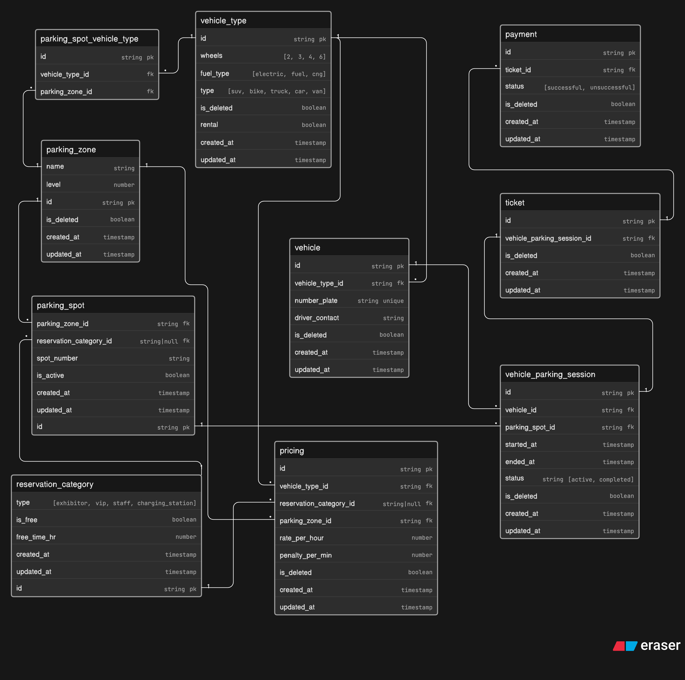

# Comic-Con Parking System ER Diagram

## Overview

This ER diagram models a multi-zone parking system for Comic-Con India, a large convention venue hosting thousands of visitors. The system tracks vehicles entering and exiting the parking facility, assigns parking spots based on vehicle type and availability, handles reserved categories for special guests, and manages payments for parking sessions.

The system supports various vehicle types (bikes, cars, SUVs, trucks, vans) and fuel types (electric, fuel, CNG), with parking zones divided into levels. Reserved parking is available for exhibitors, VIP guests, staff, and EV charging stations.

## Key Features

- **Vehicle Tracking**: Records vehicle details, types, and entry/exit times.
- **Parking Spot Allocation**: Assigns spots based on vehicle type and reservation categories.
- **Reservation Categories**: Supports special access for exhibitors, VIPs, staff, and EV charging.
- **Multi-Zone Support**: Organized parking across zones and levels.
- **Session Management**: Tracks active and completed parking sessions.
- **Payment Processing**: Records payment status for each parking session.
- **Availability Tracking**: Monitors spot availability across zones.

## Entities and Attributes

### reservation_category
- `id` (string, PK)
- `type` (enum: exhibitor, vip, staff, charging_station)
- `is_free` (boolean)
- `free_time_hr` (number)
- `created_at` (timestamp)
- `updated_at` (timestamp)

### parking_zone
- `id` (string, PK)
- `name` (string)
- `level` (number)
- `is_deleted` (boolean)
- `created_at` (timestamp)
- `updated_at` (timestamp)

### parking_spot
- `id` (string, PK)
- `parking_zone_id` (string, FK)
- `reservation_category_id` (string|null, FK)
- `spot_number` (string)
- `is_active` (boolean)
- `created_at` (timestamp)
- `updated_at` (timestamp)

### vehicle_type
- `id` (string, PK)
- `wheels` (enum: 2, 3, 4, 6)
- `fuel_type` (enum: electric, fuel, cng)
- `type` (enum: suv, bike, truck, car, van)
- `is_deleted` (boolean)
- `rental` (boolean)
- `created_at` (timestamp)
- `updated_at` (timestamp)

### vehicle
- `id` (string, PK)
- `vehicle_type_id` (string, FK)
- `number_plate` (string, unique)
- `driver_contact` (string)
- `is_deleted` (boolean)
- `created_at` (timestamp)
- `updated_at` (timestamp)

### vehicle_parking_session
- `id` (string, PK)
- `vehicle_id` (string, FK)
- `parking_spot_id` (string, FK)
- `started_at` (timestamp)
- `ended_at` (timestamp)
- `status` (enum: active, completed)
- `is_deleted` (boolean)
- `created_at` (timestamp)
- `updated_at` (timestamp)

### ticket
- `id` (string, PK)
- `vehicle_parking_session_id` (string, FK)
- `is_deleted` (boolean)
- `created_at` (timestamp)
- `updated_at` (timestamp)

### pricing
- `id` (string, PK)
- `vehicle_type_id` (string, FK)
- `reservation_category_id` (string|null, FK)
- `parking_zone_id` (string, FK)
- `rate_per_hour` (number)
- `penalty_per_min` (number)
- `is_deleted` (boolean)
- `created_at` (timestamp)
- `updated_at` (timestamp)

### payment
- `id` (string, PK)
- `ticket_id` (string, FK)
- `status` (enum: successful, unsuccessful)
- `is_deleted` (boolean)
- `created_at` (timestamp)
- `updated_at` (timestamp)

### parking_spot_vehicle_type
- `id` (string, PK)
- `vehicle_type_id` (FK)
- `parking_zone_id` (FK)

## Relationships

- reservation_category.id < parking_spot.reservation_category_id
- reservation_category.id < pricing.reservation_category_id
- parking_zone.id < parking_spot.parking_zone_id
- parking_zone.id < parking_spot_vehicle_type.parking_zone_id
- vehicle_type.id <parking_spot_vehicle_type.vehicle_type_id
- vehicle_type.id < vehicle.vehicle_type_id
- vehicle_type.id <pricing.vehicle_type_id
- parking_zone.id < pricing.parking_zone_id
- vehicle.id < vehicle_parking_session.vehicle_id
- parking_spot.id < vehicle_parking_session.parking_spot_id
- vehicle_parking_session.id - ticket.vehicle_parking_session_id
- ticket.id < payment.ticket_id

## ER Diagram

## Design Considerations

- **Multiple Visits**: Vehicles can enter multiple times; each entry creates a new session.
- **Spot Reuse**: Parking spots can be reused across sessions.
- **Availability**: Tracked via `is_active` in `parking_spot` and session status.
- **Pricing**: Based on vehicle type, zone, and reservation category.
- **Reservations**: Optional reservation categories for special parking.
- **Soft Deletes**: `is_deleted` flags for data integrity.
- **Relationships** One session shall create one ticket, however one ticket can have multiple payments, to keep track of filed payments and pending payments

This design ensures efficient tracking of parking operations for large-scale events like Comic-Con India.