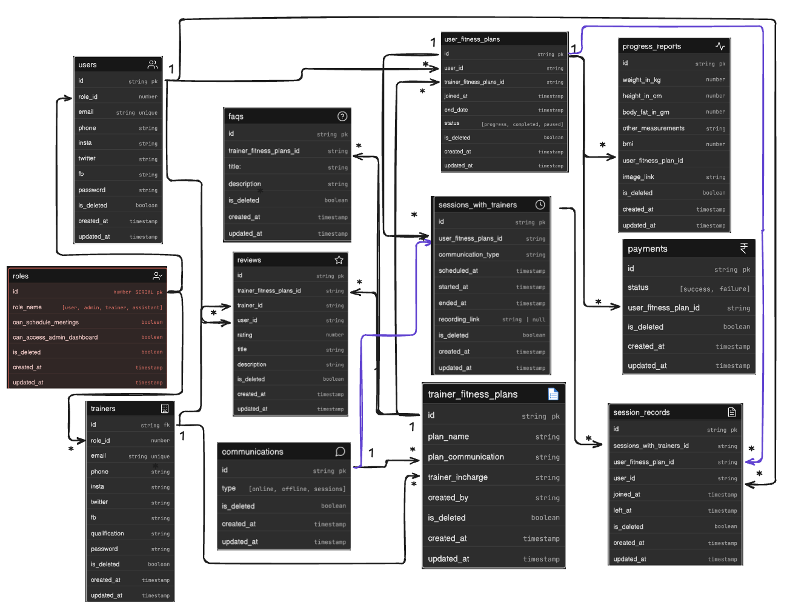

# Fitness Influencer Coaching Platform

This repository contains the Entity-Relationship (ER) design for a fitness influencer coaching platform. It defines user roles, trainers, fitness plans, subscriptions, sessions, attendance tracking, progress reporting, and payments.

---

## Overview

The platform supports:

* multiple user roles such as admin, trainer, assistant, and standard users
* trainers managing fitness plans
* users subscribing to trainer-created fitness plans
* multiple users enrolling in the same plan
* session scheduling between trainers and users
* attendance tracking for sessions
* user progress tracking through reports
* payment tracking for subscriptions
* FAQs and reviews for fitness plans

---

## Tables

### roles

* `id` number SERIAL pk
* `role_name` enum [user, admin, trainer, assistant]
* `can_schedule_meetings` boolean
* `can_access_admin_dashboard` boolean
* `is_deleted` boolean
* `created_at` timestamp
* `updated_at` timestamp

---

### users

* `id` string pk
* `role_id` number
* `email` string unique
* `phone` string
* `insta` string
* `twitter` string
* `fb` string
* `password` string
* `is_deleted` boolean
* `created_at` timestamp
* `updated_at` timestamp

---

### trainers

* `id` string fk
* `role_id` number
* `email` string unique
* `phone` string
* `insta` string
* `twitter` string
* `fb` string
* `qualification` string
* `password` string
* `is_deleted` boolean
* `created_at` timestamp
* `updated_at` timestamp

---

### trainers_users

* `id` string fk
* `user_id` string
* `trainer_id` string
* `is_deleted` boolean
* `created_at` timestamp
* `updated_at` timestamp

---

### communications

* `id` string pk
* `type` enum [online, offline, sessions]
* `is_deleted` boolean
* `created_at` timestamp
* `updated_at` timestamp

---

### trainer_fitness_plans

* `id` string pk
* `plan_name` string
* `plan_communication` string
* `trainer_incharge` string
* `created_by` string
* `is_deleted` boolean
* `created_at` timestamp
* `updated_at` timestamp

---

### user_fitness_plans

* `id` string pk
* `user_id` string
* `trainer_fitness_plans_id` string
* `joined_at` timestamp
* `end_date` timestamp
* `status` enum [progress, completed, paused]
* `is_deleted` boolean
* `created_at` timestamp
* `updated_at` timestamp

---

### faqs

* `id` string pk
* `trainer_fitness_plans_id` string
* `title` string
* `description` string
* `is_deleted` boolean
* `created_at` timestamp
* `updated_at` timestamp

---

### reviews

* `id` string pk
* `trainer_fitness_plans_id` string
* `trainer_id` string
* `user_id` string
* `rating` number
* `title` string
* `description` string
* `is_deleted` boolean
* `created_at` timestamp
* `updated_at` timestamp

---

### payments

* `id` string pk
* `status` enum [success, failure]
* `user_fitness_plan_id` string
* `is_deleted` boolean
* `created_at` timestamp
* `updated_at` timestamp

---

### sessions_with_trainers

* `id` string pk
* `user_fitness_plan_id` string
* `communication_type` string
* `scheduled_at` timestamp
* `started_at` timestamp
* `ended_at` timestamp
* `recording_link` string | null
* `is_deleted` boolean
* `created_at` timestamp
* `updated_at` timestamp

---

### session_records

* `id` string pk
* `sessions_with_trainers_id` string
* `user_fitness_plan_id` string
* `user_id` string
* `joined_at` timestamp
* `left_at` timestamp
* `is_deleted` boolean
* `created_at` timestamp
* `updated_at` timestamp

---

### progress_reports

* `id` string pk
* `weight_in_kg` number
* `height_in_cm` number
* `body_fat_in_gm` number
* `other_measurements` string
* `bmi` number
* `user_fitness_plan_id` string
* `image_link` string
* `is_deleted` boolean
* `created_at` timestamp
* `updated_at` timestamp

---

## Key Relationships

* `users.role_id` > `roles.id`
* `trainers.role_id` > `roles.id`
* `trainers_users.user_id` > `users.id`
* `trainers_users.trainer_id` > `trainers.id`
* `trainer_fitness_plans.created_by` > `trainers.id`
* `user_fitness_plans.user_id` > `users.id`
* `user_fitness_plans.trainer_fitness_plans_id` > `trainer_fitness_plans.id`
* `faqs.trainer_fitness_plans_id` > `trainer_fitness_plans.id`
* `reviews.trainer_fitness_plans_id` > `trainer_fitness_plans.id`
* `reviews.user_id` > `users.id`
* `reviews.trainer_id` > `trainers.id`
* `payments.user_fitness_plan_id` > `user_fitness_plans.id`
* `sessions_with_trainers.user_fitness_plan_id` > `user_fitness_plans.id`
* `session_records.sessions_with_trainers_id` > `sessions_with_trainers.id`
* `session_records.user_id` > `users.id`
* `session_records.user_fitness_plan_id` > `user_fitness_plans.id`
* `progress_reports.user_fitness_plan_id` > `user_fitness_plans.id`

---

## Design Notes

* The `roles` table defines access control for different types of users.
* Soft deletes are implemented using `is_deleted` across tables.
* `trainer_fitness_plans` represents plans created and managed by trainers.
* `user_fitness_plans` acts as a subscription table linking users to plans.
* Sessions are stored in `sessions_with_trainers` and are tied to a user’s plan.
* `session_records` tracks attendance details for each session.
* `progress_reports` stores user progress data such as weight, body fat, and measurements.
* `payments` tracks payment status for subscriptions.

---

## Usage

Open `ER.png` to view the ER diagram visually.
