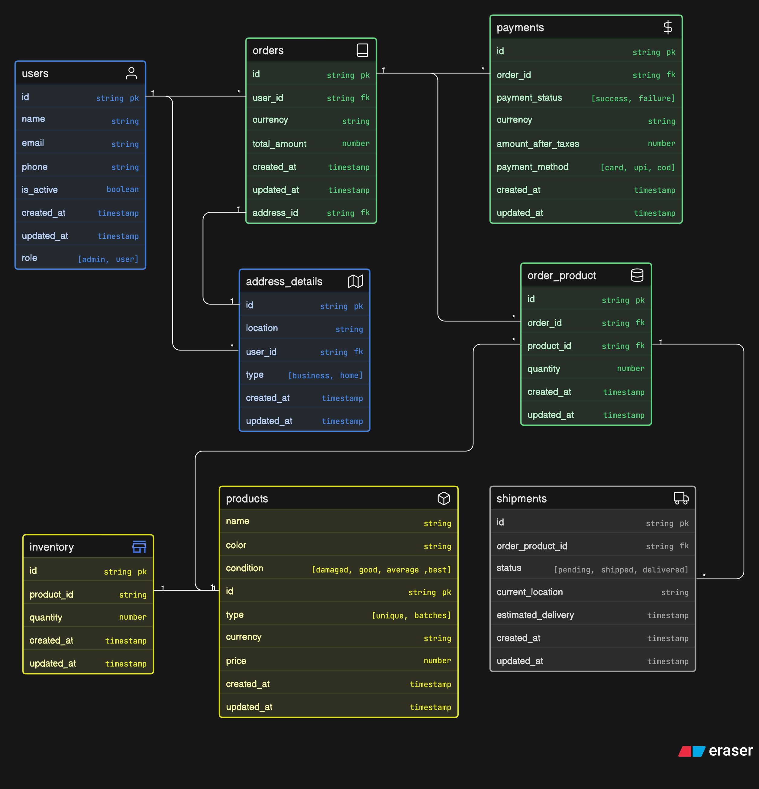

# ER Diagram for Instagram Thrift Store

## Overview

This document describes the Entity-Relationship (ER) diagram for the Instagram Thrift Store database. The system manages users, products, inventory, orders, shipments, payments, and address details for an online thrift store platform.

## Entities

### Users

- **id** (string, primary key)
- **name** (string)
- **email** (string)
- **phone** (string)
- **is_active** (boolean)
- **created_at** (timestamp)
- **updated_at** (timestamp)
- **role** (enum: admin, user)

### Products

- **id** (string, primary key)
- **name** (string)
- **color** (string)
- **condition** (enum: damaged, good, average, best)
- **type** (enum: unique, batches)
- **currency** (string)
- **price** (number)
- **created_at** (timestamp)
- **updated_at** (timestamp)

### Inventory

- **id** (string, primary key)
- **product_id** (string, foreign key to products.id)
- **quantity** (number)
- **created_at** (timestamp)
- **updated_at** (timestamp)

### Orders

- **id** (string, primary key)
- **user_id** (string, foreign key to users.id)
- **address_id** (string, foreign key to address_details.id)
- **currency** (string)
- **total_amount** (number)
- **created_at** (timestamp)
- **updated_at** (timestamp)

### Shipments

- **id** (string, primary key)
- **order_product_id** (string, foreign key to order_product.id)
- **status** (enum: pending, shipped, delivered)
- **current_location** (string)
- **estimated_delivery** (timestamp)
- **created_at** (timestamp)
- **updated_at** (timestamp)

### Order_Product

- **id** (string, primary key)
- **order_id** (string, foreign key to orders.id)
- **product_id** (string, foreign key to products.id)
- **quantity** (number)
- **created_at** (timestamp)
- **updated_at** (timestamp)

### Payments

- **id** (string, primary key)
- **order_id** (string, foreign key to orders.id)
- **payment_status** (enum: success, failure)
- **currency** (string)
- **amount_after_taxes** (number)
- **payment_method** (enum: card, upi, cod)
- **created_at** (timestamp)
- **updated_at** (timestamp)

### Address_Details

- **id** (string, primary key)
- **location** (string)
- **user_id** (string, foreign key to users.id)
- **type** (enum: business, home)
- **created_at** (timestamp)
- **updated_at** (timestamp)

## Relationships

- **Users** to **Address_Details**: One-to-many (a user can have multiple addresses)
- **Users** to **Orders**: One-to-many (a user can have multiple orders)
- **Products** to **Inventory**: One-to-one (each product has one inventory record)
- **Products** to **Order_Product**: One-to-many (a product can be in multiple order products)
- **Orders** to **Address_Details**: Many-to-one (orders reference an address)
- **Orders** to **Order_Product**: One-to-many (an order can have multiple products)
- **Orders** to **Payments**: One-to-many (an order can have multiple payments)
- **Order_Product** to **Shipments**: One-to-many (an order product can have multiple shipments)

## Additional Notes

- A user can be either a normal user or an admin and can place multiple orders.
- An order can contain multiple products, and the same product can appear in multiple orders, hence the Order_Product junction table.
- Each product has an associated inventory record.
- A user can have multiple addresses (business or home).
- Each Order_Product entry can have multiple shipment details.
- An order can have multiple payment attempts (success, failure, etc.).

## ER Diagram

