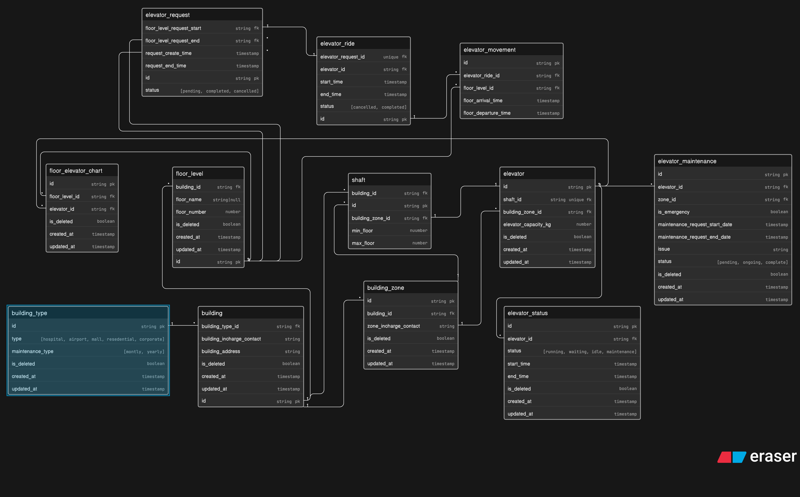

# Smart Elevator Control Platform ER Design

This ER design supports LiftGrid Systems’ intelligent elevator control platform for large commercial buildings. It captures multi-building operations, elevator zones, floor-level requests, ride assignment, elevator status tracking, maintenance workflows, and usage logs.

## Key Tables

- `building_type`
  - Defines building categories like hospitals, airports, malls, residential complexes, and corporate towers.
  - Tracks the building maintenance schedule type.

- `building`
  - Represents each connected building.
  - Links to `building_type` and stores building contact/address details.

- `building_zone`
  - Represents elevator zones inside a building.
  - Each zone may control a subset of floors and elevators.

- `shaft`
  - Optional structural entity representing a physical elevator shaft.
  - Associates with a building and zone, and defines the floor range served by the shaft.

- `elevator`
  - Represents a single elevator unit inside a shaft.
  - Linked to its shaft and zone, plus capacity and soft-delete information.

- `floor_level`
  - Represents a floor in a building.
  - Each floor belongs to a building and can optionally be served by multiple elevators.

- `floor_elevator_chart`
  - Mapping table showing which elevators can serve which floors.
  - Enables many-to-many relationships between floors and elevators.

- `elevator_status`
  - Tracks current and historical elevator states (`running`, `waiting`, `idle`, `maintenance`).
  - Records time intervals for each status period.

- `elevator_maintenance`
  - Tracks maintenance requests and history for each elevator.
  - Includes emergency flags, issue descriptions, request windows, and status.

- `elevator_request`
  - Represents a floor-to-floor request generated by a user.
  - Tracks request source and destination floors, creation/end timestamps, and current status.

- `elevator_ride`
  - Represents the ride assignment handling a request.
  - Links a request to a specific elevator and records ride duration and completion state.

- `elevator_movement`
  - Logs the elevator’s floor-by-floor movement during a ride.
  - Records arrival and departure times for each floor visited.

## Usage Questions Supported

This design can answer questions such as:
- How many buildings are connected?
- How many elevators exist inside each building?
- Which floors belong to each building?
- Which elevator serves which floors?
- Which elevator handled a particular request?
- Can multiple elevators serve the same floor? Yes, via `floor_elevator_chart`.
- Can one elevator serve multiple floors? Yes, by linking an elevator to many floor records.
- What is the status of each elevator? Tracked in `elevator_status`.
- How many rides did an elevator complete today? Query `elevator_ride` by `elevator_id` and date.
- Which elevator handled the most requests? Aggregate `elevator_ride` by `elevator_id`.
- Which requests are still pending? Filter `elevator_request.status = 'pending'`.
- Can an elevator be temporarily disabled for maintenance? Yes, through `elevator_status` and `elevator_maintenance`.
- Can maintenance history be tracked per elevator? Yes, via `elevator_maintenance`.
- Can ride logs be recorded for analytics later? Yes, via `elevator_ride` and `elevator_movement`.

## ER Diagram

The ER diagram image is available as `ER.png` in this folder.

## Eraser Code

```eraser
building_type {
  id string pk
  type [hospital, airport, mall, residential, corporate]
  maintenance_type [monthly, yearly]
  is_deleted boolean
  created_at timestamp
  updated_at timestamp
}
building {
  id string pk
  building_type_id string fk
  building_incharge_contact string
  building_address string
  is_deleted boolean
  created_at timestamp
  updated_at timestamp
}

building_zone {
  id string pk
  building_id string fk
  zone_incharge_contact string
  is_deleted boolean
  created_at timestamp
  updated_at timestamp
}

shaft {
  id string pk
  building_id string fk
  building_zone_id string fk
  min_floor number
  max_floor number
}

elevator {
  id string pk
  shaft_id string unique fk
  building_zone_id string fk
  elevator_capacity_kg number
  is_deleted boolean
  created_at timestamp
  updated_at timestamp
}

elevator_status {
  id string pk
  elevator_id string fk
  status [running, waiting, idle, maintenance]
  start_time timestamp
  end_time timestamp
  is_deleted boolean
  created_at timestamp
  updated_at timestamp
}

elevator_maintenance {
  id string pk
  elevator_id string fk
  zone_id string fk
  is_emergency boolean
  maintenance_request_start_date timestamp
  maintenance_request_end_date timestamp
  issue string
  status [pending, ongoing, complete]
  is_deleted boolean
  created_at timestamp
  updated_at timestamp
}

floor_level {
  id string pk
  building_id string fk
  floor_name string|null
  floor_number number
  is_deleted boolean
  created_at timestamp
  updated_at timestamp
}

elevator_request {
  id string pk
  floor_level_request_start string fk
  floor_level_request_end string fk
  request_create_time timestamp
  request_end_time timestamp
  status [pending, completed, cancelled]
}

elevator_ride {
  id string pk
  elevator_request_id string unique fk
  elevator_id string fk
  start_time timestamp
  end_time timestamp
  status [cancelled, completed]
}

elevator_movement {
  id string pk
  elevator_ride_id string fk
  floor_level_id string fk
  floor_arrival_time timestamp
  floor_departure_time timestamp
}

floor_elevator_chart {
  id string pk
  floor_level_id string fk
  elevator_id string fk
  is_deleted boolean
  created_at timestamp
  updated_at timestamp
}

building_type.id < building.building_type_id: [color: black]
building.id < building_zone.building_id: [color: black]

building.id < shaft.building_id
building_zone.id < shaft.building_zone_id

shaft.id - elevator.id
building_zone.id < elevator.building_zone_id

building.id < floor_level.building_id: [color: black]

floor_level.id < floor_elevator_chart.floor_level_id
    elevator.id < floor_elevator_chart.elevator_id

elevator.id < elevator_status.elevator_id

elevator.id < elevator_maintenance.elevator_id

floor_level.id < elevator_request.floor_level_request_start
floor_level.id < elevator_request.floor_level_request_end
floor_level.id < elevator_movement.floor_level_id

elevator_request.id - elevator_ride.id
    elevator_ride.id < elevator_movement.elevator_ride_id
```

## ER Diagram

