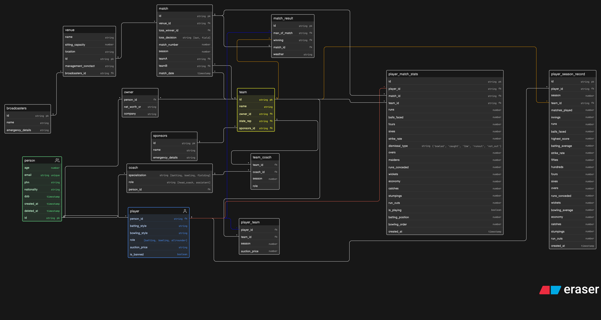

# IPL Management System

This repository contains the IPL Management System database schema and ER diagram. The schema is based on the provided Eraser diagram and includes tables for people, teams, matches, player statistics, and related entities.

## Tables and Purpose

- `person`
  - Stores all people in the system, including owners, coaches, and players.
  - Fields: `id`, `age`, `email`, `phn`, `nationality`, `dob`, `created_at`, `deleted_at`.

- `owner`
  - Links a person to an IPL team owner record.
  - Fields: `person_id`, `net_worth_cr`, `company`.

- `coach`
  - Stores coach-specific information for people with coach roles.
  - Fields: `person_id`, `specialization`, `role`.

- `broadcasters`
  - Contains broadcaster details for venues and matches.
  - Fields: `id`, `name`, `emergency_details`.

- `sponsors`
  - Stores sponsor details associated with teams.
  - Fields: `id`, `name`, `emergency_details`.

- `team`
  - Represents IPL teams, including owner, state representative, and sponsors.
  - Fields: `id`, `name`, `owner_id`, `state_rep`, `sponsors_id`.

- `team_coach`
  - Associates coaches with teams for a specific season.
  - Fields: `team_id`, `coach_id`, `season`, `role`.

- `player_team`
  - Records which player belongs to which team in a season and auction price.
  - Fields: `player_id`, `team_id`, `season`, `auction_price`.

- `player`
  - Extends `person` with player-specific attributes.
  - Fields: `person_id`, `batting_style`, `bowling_style`, `role`, `auction_price`, `is_banned`.

- `player_season_record`
  - Stores aggregated season performance statistics for each player.
  - Fields include `id`, `player_id`, `season`, `team_id`, `matches_played`, `innings`, `runs`, `balls_faced`, `highest_score`, `batting_average`, `strike_rate`, `fifties`, `hundreds`, `fours`, `sixes`, `overs`, `runs_conceded`, `wickets`, `bowling_average`, `economy`, `catches`, `stumpings`, `run_outs`, `created_at`.

- `venue`
  - Stores venue information where IPL matches are played.
  - Fields: `id`, `name`, `sitting_capacity`, `location`, `management_conctact`, `broadcasters_id`.

- `match`
  - Stores match details, including participating teams, venue, toss results, and schedule.
  - Fields: `id`, `teamA`, `teamB`, `venue_id`, `toss_winner_id`, `toss_decision`, `match_number`, `season`, `match_date`.

- `match_result`
  - Stores the outcome of each match.
  - Fields: `id`, `man_of_match`, `winning`, `match_id`, `weather`.

- `player_match_stats`
  - Stores per-match player statistics and performance details.
  - Fields include `id`, `player_id`, `match_id`, `team_id`, `runs`, `balls_faced`, `fours`, `sixes`, `strike_rate`, `dismissal_type`, `overs`, `maidens`, `runs_conceded`, `wickets`, `economy`, `catches`, `stumpings`, `run_outs`, `is_playing`, `batting_position`, `bowling_order`, `created_at`.

## ER Diagram

The ER diagram is attached as `ER.png` in this folder.



## ER Schema Source Code

```txt
person [icon: users ,color:green]{
  id string pk
  age number
  email string unique
  phn string
  nationality string
  dob timestamp
  created_at timestamp
  deleted_at timestamp
}

owner {
  person_id fk
  net_worth_cr string
  company string
}

coach {
  person_id fk
  specialization string [batting, bowling, fielding]
  role string [head_coach, assistant]
}

broadcasters {
  id string pk
  name string
  emergency_details string
}
sponsors {
  id string pk
  name string
  emergency_details string
}
team [color: yellow]{
  id string pk
  name string
  owner_id string fk
  state_rep string fk
  sponsors_id string fk
}
team_coach {
  team_id fk
  coach_id fk
  season number
  role
}
player_team {
  player_id fk
  team_id fk
  season number
  auction_price number
}
player [icon: user, color: blue]{
  person_id string fk
  batting_style string
  bowling_style string
  role [batting, bowling, allrounder]
  auction_price string
  is_banned boolean
}

player_season_record {
  id string pk
  player_id string fk
  season number
  team_id string fk
  matches_played number
  innings number
  runs number
  balls_faced number
  highest_score number
  batting_average number
  strike_rate number
  fifties number
  hundreds number
  fours number
  sixes number
  overs number
  runs_conceded number
  wickets number
  bowling_average number
  economy number
  catches number
  stumpings number
  run_outs number
  created_at timestamp
}

venue {
  id string pk
  name string
  sitting_capacity number
  location string
  management_conctact string
  broadcasters_id string fk
}

match {
  id string pk
  teamA string fk
  teamB string fk
  venue_id string fk
  toss_winner_id fk
  toss_decision string [bat, field]
  match_number number
  season number
  match_date timestamp
}
match_result {
  id string pk
  man_of_match string fk
  winning string fk
  match_id fk
  weather string
}

player_match_stats {
  id string pk
  player_id string fk
  match_id string fk
  team_id string fk

  runs number
  balls_faced number
  fours number
  sixes number
  strike_rate number
  dismissal_type string ('bowled', 'caught', 'lbw', 'runout', 'not_out')
  overs number
  maidens number
  runs_conceded number
  wickets number
  economy number
  catches number
  stumpings number
  run_outs number
  is_playing boolean
  batting_position number
  bowling_order number
  created_at timestamp
}

person.id < owner.person_id
person.id < player.person_id
person.id < coach.person_id
owner.person_id > team.id
coach.person_id < team_coach.coach_id
player.person_id < player_team.player_id: [color: blue]
team.id < team_coach.team_id
team.id < player_team.team_id
sponsors.id < team.sponsors_id
broadcasters.id < venue.broadcasters_id
venue.id < match.venue_id
match.teamA > team.id
match.teamB > team.id
match.id - match_result.match_id
team.id < match_result.winning: [color: orange]
player.person_id < match_result.man_of_match: [color: blue]
team.id < player_match_stats.team_id
player.person_id < player_match_stats.player_id: [color: "#ae1700"]
match.id < player_match_stats.match_id
player.person_id < player_season_record.player_id
team.id < player_season_record.team_id: [color: orange]
```
